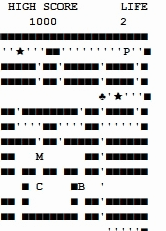
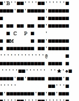

# pacberman

## 소개
팩맨과 봄버맨을 섞은 자바 콘솔 게임입니다.

## 주요 기능

### 규칙
지도에 있는 동전(')과 아이템(★)을 전부 획득하면 승리합니다. 
적들인 블랑키(B), 민키(M), 핑키(P), 클라이드(C)와 닿으면 목숨을 잃습니다.

### 캐릭터
사용자가 고를 수 있는 캐릭터는 2가지가 있습니다. 
 
1. 팩맨(♣): 동전 20개나 아이템을 먹으면 하트로 변신(♥)하며 적을 물리칠 수 있습니다. 
 
2. 봄버맨(♠): 폭탄(@)을 설치하여 적을 물리칠 수 있습니다. 폭탄은 3초 후 폭발합니다. 단, 폭탄에 자신이 죽을 수도 있습니다. 

### 조작
방향 전환은 W,A,S,D 입력 후 엔터 
폭탄설치(봄버맨전용)는 스페이스바를 입력 후 엔터 
캐릭터가 죽으면 시작위치(중앙 하단)에서 다시 시작 
적들을 죽이면 적들은 적 시작위치(중앙)에서 부활 

### 점수
동전을 먹으면 10점을 획득합니다. 
팩맨이 아이템(★)을 먹으면 변신하며 200점을 획득합니다. 봄버맨이 아이템(★)을 먹으면 200점만 획득합니다. 
2500점을 획득할 때 마다 목숨이 1씩 증가합니다. 
